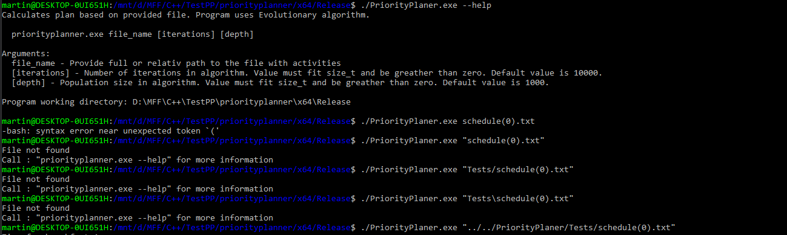

Meno: Martin Bakoš

# Zápočtový program PriorityPlaner

## Anotácia

Zorganizovať a naplánovať si aktivity počas dňa je často zložité. Vyhodnotiť všetky faktory ako čas, dôležitosť či miesto a zostaviť podľa nich rozvrh je skutočne neľahká úloha. Preto by bolo vhodné aby za nás ťažkú prácu urobil program. Priority Planer sa zo zadaných dát snaží zostaviť ideálny rozvrh. 

## Zadanie

 > Description.md

## Zvolený algoritmus

Úloha zostavenia ideálneho rozvrhu je NP-úplná ( podobná problému batohu ). Napriek obmedzeniam som neprišiel na polynomialne riešenie. Aby program aj pre väčšie vstupy dobehol v rozumnom čase využíva evolučný algoritmus. Výsledok programu nieje ideálny rozvrh ale len jeho aproximácia.

Algoritmus riešenia sa delí na dve časti - zhotovenie plánu pre povinne aktivity a jeho rozšírenie o zvyšné aktivity.

Plán povinných aktivít sa zostrojí pomocou rekurzívneho prehľadávania usporiadaní týchto aktivít.

Rozširovanie základného plánu sa uskutočňuje pomocou evolučného algoritmu s nasledujúcim priebehom:

* Rozvrhy usporiadame podla priority. 
* Najhoršiu štvrtinu rozvrhov nahradíme najlepšou štvrtinou rozvrhov.
* Následne "zmutujeme" (vymeníme poradie aktivít, pridáme či odoberieme aktivity alebo zmeníme ich dĺžku) spodné tri štvrtiny rozvrhov ( kde posledná štvrtina bola nahradená v predchádzajúcom kroku).

Evolučnú časť opakujeme stanovený počet iterácií so stanoveným počtom rozvrhov v generácii.

## Program
V tejto časti sa budeme venovať popisu dôležitých častí programu- dátovým typom a triedam. Cieľom je, popísať ich význam, fungovanie a spoluprácu zo zvyškom programu.

### PriorityPlaner

V metóde main definuje hlavný chod programu.

### Contorler

Zabezpečuje načítanie dát zo vstupu do dátových štruktúr. Pri chybnom vstupe vypíše čísla riadkov a popis chyby zo vstupného súboru. Chyby sú bližšie popísané v časti Výstupné dáta.

### Model

Implementuje algoritmus riešenia popísaný v časti Zvolený algoritmus. Prvá časť algoritmu je naimplementovaná v metóde `void find_mandatory_plan();`. Evolučný cyklus implementuje metóda `void evolution();`. Výpočet najlepšie rozvrhu riadi metóda  `void Calculate();`.

### View

Výpis najlepšieho rozvrhu na štandardný výstup pomocou metódy `void View::print_timeline(const Model& model, ostream& output) const`. Formát výpisu je bližšie popísaný v časti Výstupné dáta.

#### TimeData

Reprezentácia času s presnosťou na minúty. Maximálna hodnota je 7 dní (6:23:59).

#### ActivityPlan

Informácie o naplánovanej aktivite. Index aktivity a dĺžka jej vykonávania.

#### IndexedUnorderedMap

Dátová štruktúra, v ktorej je možne k dátam (Value) pristupovať pomocou kľúča (Key) v logaritmickom čase a pomocou indexu v konštantnom čase. Prevod kľúča na index je v logaritmickom čase a z indexu na kľuč v konštantnom. Odstránenie dát je ale náročnejšie s lineárnou zložitosťou.

#### Graph

Reprezentácia grafu so vzdialenosťami. Vrcholy sú indexované. Prístup k vrcholom je pomocou hodnoty  vo vrchole (Node) v logaritmickom čase a pomocou indexu v konštantnom čase.

#### GraphDistances

Pre daný graf obsahuje vzájomné vzdialenosti medzi jednotlivými vrcholmi grafu. Vyhľadávanie vzdialenosti je pomocou indexov z pôvodného grafu. 

#### PlanningData

Trieda reprezentujúca všetky informácie zo vstupného súboru. Kontroluje korektnosť pridávaných dát. 

#### ActivityData

Štruktúra obsahujúca údaje o aktivite.

## Vstupné dáta

Popis volania programu:

`priorityplanner.exe file_name [iterations] [depth]`

Povinný prvý argument `file_name` by mal obsahovať plnú alebo relatívnu (vzhľadom na pracovný priečinok programu) cestu k súboru popisujúcemu aktivity v špecifickom formáte. Argumenty `iterations` a `depth` sú nepovinné. `iterations` určuje počet iterácií evolučného algoritmu. `depth` určuje veľkosť populácie algoritmu.

Pre informácie o volaní programu môže užívateľ zavolať program s parametrom "--help"

`priorityplanner.exe --help`

### Popis formátu

Vstupný súbor sa skladá z rôznych sekcií. Sekcia sa uvedie pomocou jej názvu. Každá sekcia sa môže v súbore vyskytovať viac krát ale doporučujem každú sekciu definovať práve raz v poradí ako sú v príklade. Závislosť medzi dátami v sekciách je acyklická. Pri zadávaní dát v sekcií musia byť všetky užívateľské parametre, ktoré k dátam patria, vopred definované v predchádzajúcich sekciách.
Uvedenie sekcie a dáta musia byť oddelené koncom riadku. Prázdne riadky sa ignorujú ale whitespace nie.

### Sekcie

#### Timeframe

Section name:
> TIMEFRAME 

Data format:
> (start)D:HH:MM;(end)D:HH:MM 

Zadanie času začiatku a konca pre plánovaný rozvrh. Prvá aktivita rozvrhu záčina po "start" a posledná konči pred "end". Použije sa posledne definovaný TIMEFRAME. Ak timeframe nieje definovaný rozvrh záčina v čase 0 a konči v maximálnom možnom čase.

#### Places

Section name:
> PLACES 

Data format:
> (location_name)string

Názvy miest na, ktorých sa aktivity môžu odohrávať. Názvy musia byť unikátne.

#### Distances

Section name:
> DISTANCES 

Data format:
> (location_name_1)string;(location_name_2)string;(duration)D:HH:MM 

Zadanie vzdialenosti, času prepravy, z lokácie 1 do lokácie 2 a opačne. Lokácie musia byť vopred definované.

#### Categories

Section name:
> CATEGORIES

Data format:
> (category_name)string;(max_duration)D:HH:MM 

Kategórie pre aktivity s obmedzením maximálnej dĺžky, ktorú môžu aktivity z danej kategórie v rozvrhu zaberať. Názvy musia byť unikátne.

#### Start location

Section name:
> START_LOCATION 

Data format:
> location_name 

Názov miesta z, ktorého sa záčina plánovanie. Použije sa posledná definovaná lokácia. Pokiaľ počiatočná lokácia nieje definovaná, použije sa default place, ktorý nieje spojený s užívateľom definovanými miestami.

#### Activities

Section name:
> ACTIVITIES 

Data format:
> (activity_name)string;(place_name)string;(category_name)string,...;(priority)size_t;(start_time)D:HH:MM;(end_time)D:HH:MM;(min_duration)D:HH:MM;(max_duration)D:HH:MM

Popis aktivity pre rozvrh. Parametre place_name a category_name niesu povinné (argument môže byť prázdny tj. ""). Pokiaľ nieje zadaný parameter place_name, použije sa default place, ktorý nieje spojený s užívateľom definovanými miestami. Aktivita môže byť súčasťou viacerých kategórií (oddelených ","). V prípade, že kategória nieje definovaná, použije sa default kategória bez časového obmedzenia. Parameter priority má číselnú hodnotu, ktorá sa musí zmestiť do size_t alebo "max" pokiaľ ide o povinnú aktivitu.  Názvy aktivít musia byť unikátne.

#### Activities order

Section name:
> ACTIVITIES_ORDER 

Data format:
> (activity_name_1)string;(activity_name_2)string

Pravidlo medzi dvomi aktivitami, aktivita 2 nemôže bezprostredne nasledovať po aktivite 1 v rozvrhu.

### Prikald volania programu

### Prikald Súboru s aktivitami
>  TIMEFRAME  
>  0:7:00;0:23:59  
>  
>  PLACES  
>  home  
>  belusa  
>  puchov  
>  
>  DISTANCES  
>  home;belusa;0:00:05  
>  home;puchov;0:00:12  
>  
>  CATEGORIES  
>  
>  sport;0:4:36  
>  game;0:3:00  
>  school;0:8:15  
>  
>  START_LOCATION  
>  home  
>  
>  ACTIVITIES  
>  running;belusa;sport;90;0:08:00;0:20:00;0:0:30;0:1:30  
>  swimming;puchov;sport;100;0:10:00;0:13:00;0:0:30;0:0:43  
>  biking;belusa;sport;120;0:16:00;0:20:00;0:0:45;0:1:07  
>  programing;home;school;1000;0:10:20;0:18:45;0:3:11;0:5:23  
>  launch;home;;max;0:10:00;0:13:00;0:0:30;0:0:30  
>  gaming;home;game;500;0:20:20;0:23:45;0:2:21;0:2:57  
>  vr;home;game,sport;600;0:8:00;0:13:45;0:1:21;0:2:57  
>  x;home;game,sport,school;100;0:8:00;0:23:45;0:00:01;0:00:07  
>  
>  ACTIVITIES_ORDER  
>  running;swimming 
>  running;biking  
>  swimming;biking   

## Vystupné dáta

Výpis chýb vo vstupnom súbore alebo popis aktivít v poradí a časoch ako ich vykonávať podľa najlepšieho rozvrhu.

### Príklad - Výpis rozvrhu

> Time for vr from  categories game and sport  
> day 0 08:00 - day 0 10:54  
> Time for x from  categories game, sport and school  
> day 0 10:54 - day 0 11:00  
> Time for launch  
> day 0 11:00 - day 0 11:30  
> Travel from home to puchov  
> day 0 11:30 - day 0 11:42  
> Time for swimming from category sport  
> day 0 11:42 - day 0 12:22  
> Travel from puchov to home  
> day 0 12:22 - day 0 12:34  
> Time for programing from category school  
> day 0 12:34 - day 0 17:56  
> Travel from home to belusa  
> day 0 17:56 - day 0 18:01  
> Time for biking from category sport  
> day 0 18:01 - day 0 18:57  

#### interpretácia 

> Time for swimming from category sport  
> day 0 11:42 - day 0 12:22

Vykonávanie aktivity "swimming" z kategorie "sport" je naplánované v čase od 11:42 do 12:22 v prvý deň rozvrhu.

### Príklad - Chyby

Vstup

> ahoj  
> 
> TIMEFRAME  
> 0:7:00;0:23:59  
> 
> PLACES  
> home  
> belusa  
> puchov  
> praha;brno  
> 
> DISTANCES  
> home;belusa;0:00:05  
> home;puchov;0:00:12  
> belusa;puchov;0:00:AB  
> 
> CATEGORIES  
> sport;0:4:36  
> game;0:3:00  
> school;0:8:15  
> 
> START_LOCATION  
> praha  
> 
> ACTIVITIES  
> running;belusa;sport;90;0:08:00;0:20:00;0:0:30;0:1:30  
> swimming;puchov;sport;osem;0:10:00;0:13:00;0:0:30;0:0:43  
> biking;belusa;sport;120;0:16:00;0:20:00;0:0:45;0:1:07  
> programing;home;school;1000;0:10:20;0:18:45;0:3:11;0:5:23  
> launch;home;;max;0:10:00;0:13:00;0:0:30;0:0:30  
> gaming;home;game;500;0:20:20;0:23:45;0:2:21;0:2:57  
> vr;home;game,sport;20;0:8:00;0:13:45;0:1:21;0:2:57  
> x;home;game,sport,school;100;0:8:00;0:23:45;0:00:01;0:00:07  
> 
> ACTIVITIES_ORDER  
> running;swimming  
> running;biking  
> swimming;biking  

Výstup

> On line 1 - Section not setted  
> On line 10 - Incorrect number of data  
> On line 15 - Invalid time format  
> On line 23 - Invalid data  
> On line 27 - Invalid priority value  
> Invalid Input  

#### Interpretácia chybových výstupov

> Incorrect number of data

Nesprávny počet argumentov pre dáta v danej sekcií.

>  Invalid data

Niektorý z argumentov nebol definovaný alebo nemá požadovaný formát.

> Invalid time format

Časový údaj je zadaný v nesprávnom formáte.

> Section not setted

Vstupný súbor nedefinoval prvú sekciu.

> Invalid priority value

nesprávny formát hodnoty priority.

> Unrecognized error

Pri načítaní došlo k neidentifikovateľnej chybe. 

